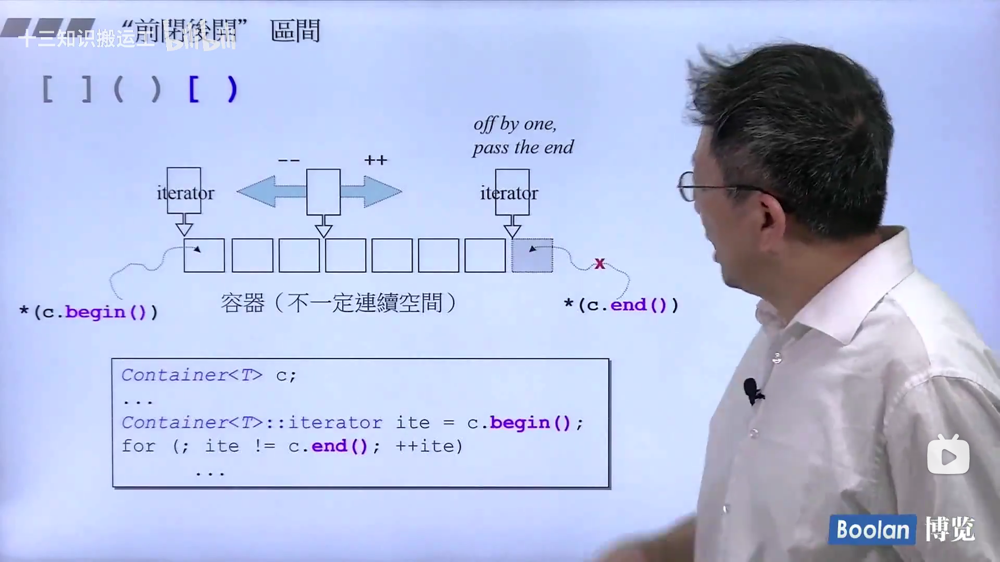

## 第一讲:STL体系结构介绍

### c++标准库 vs c++ Standard Library

总体来说  c++标准库 > c++ Standard Library

标准库以头文件（.h）的形式呈现:
* c++标准库的header files不带副档名（.h）, 例如#include <vector>
* 新式c header files 不带副档名（.h），例如 #include <cstdio>
* 旧式c header files 带有副档名（.h）仍然可用，例如 #include <stdio.h>
* 新式headers内的组件封装为 namespace "std"
    * using namespace std;（相当于把std文件全部打开）
    * using std::cout;
* 旧式headers内的组件不封装在namespace "std"

demo：
```c++
#include <string>
#include <iostream>
#include <vector>
#include <algorithm>
#include <functional>
using namespace std;
```

### 重要的网站（c++标准库）

* [cplusplus.com](https://www.cplusplus.com/)
* [cppreference.com](https://en.cppreference.com/w/)
* [gcc.gnu.org](http://gcc.gnu.org/)

### STL六大部件

* 容器（containers）
* 分配器（allocators）
* 算法（algorithms）
* 迭代器（iterators）
* 适配器（addpters）
* 仿函数（functors）


六大部件的关系：
* 容器可以使我们不用管c++的内存，分配器支持容器进行内存管理。
* 容器的数据操作使用算法，访问数据使用迭代器，迭代器（类似于指针）是算法操作容器内部数据的桥梁。
* 仿函数类似于函数，暂时可以用函数来理解。
* 适配器是用来转换的，可以对容器，仿函数，迭代器进行转换。


**模版编程和面向对象编程的区别**
* 模版编程的算法另外封装，而面向对象中将操作数据的算法（或者称为函数）封装在类的内部。

demo:
```c++
#include <vector>
#include <algorithm>
#include <functional>
#include <iostream>

using namespace std;

int main()
{
    int ia[6] = {21,350, 12, 109, 83, 2};
    //allocator代表分配器，不过标准库中有默认的分配器，实际使用时不需要写
    vector<int, allocator<int>> vi(ia, ia + 6);
    /**
     * count_if代表一个算法：计算出符合给出条件的元素有几个
     * vi.begin()和vi.end()代表迭代器
     * 这里的条件是大于等于40：not1(bind2nd(less<int>(), 40))
     * less<int>()是一个仿函数
     * bind2nd代表一个配置器：功能为绑定第二个参数，这里就是将仿函数中的a < b变成了a < 40
     * not1也是一个配置器：功能为将 "<40" 改成 ">=40"
     * */
    cout << count_if(vi.begin(), vi.end(), not1(bind2nd(less<int>(), 40)));
    return 0;
}
```

### 使用前闭后开区间
也就是所谓的 "[  )"  

范例：



**适度使用auto（c++11引入）**：


