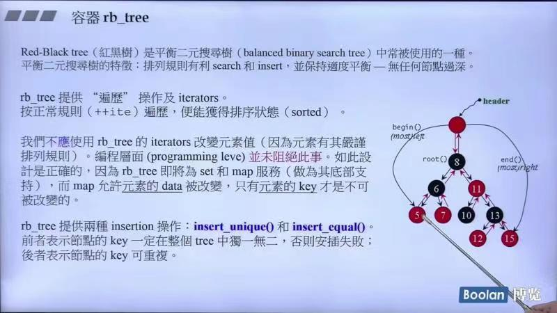
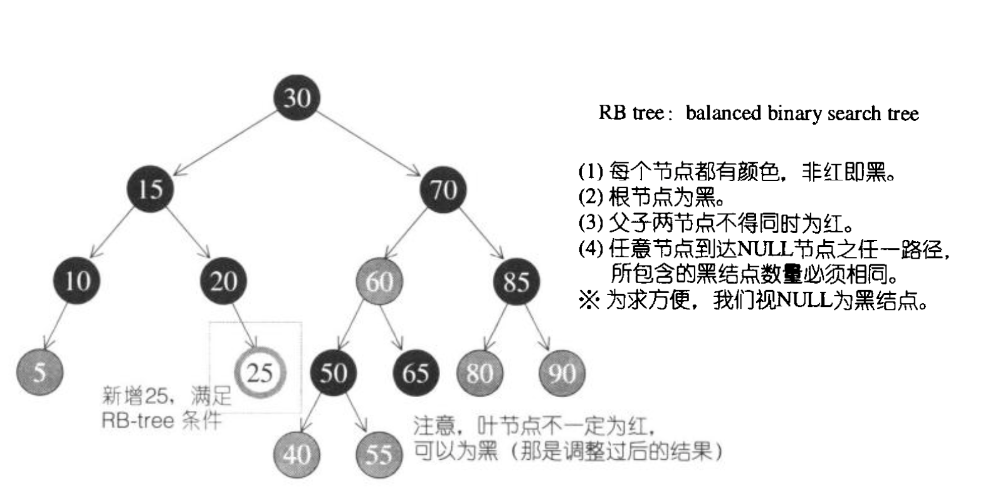
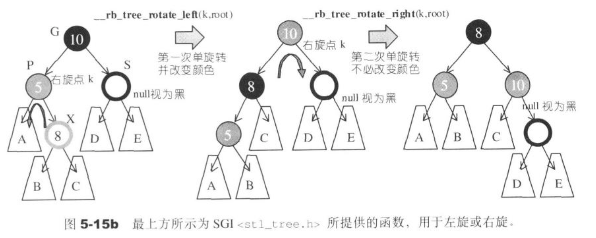
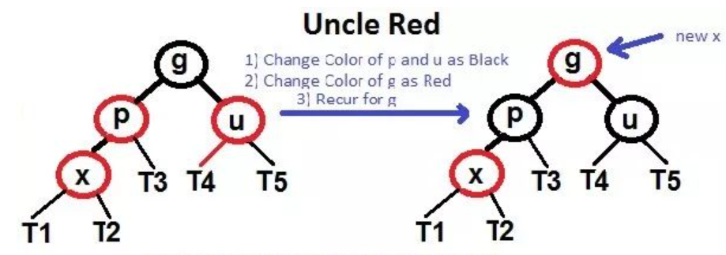
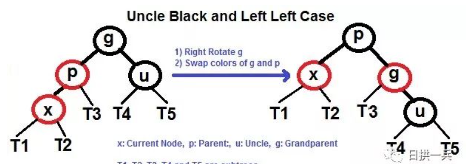
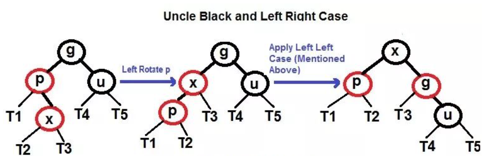
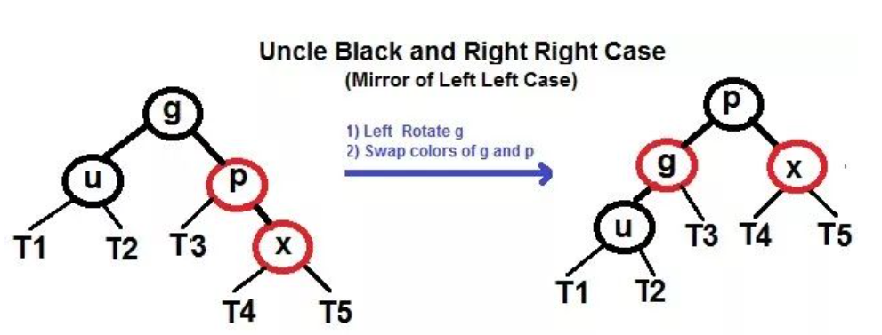
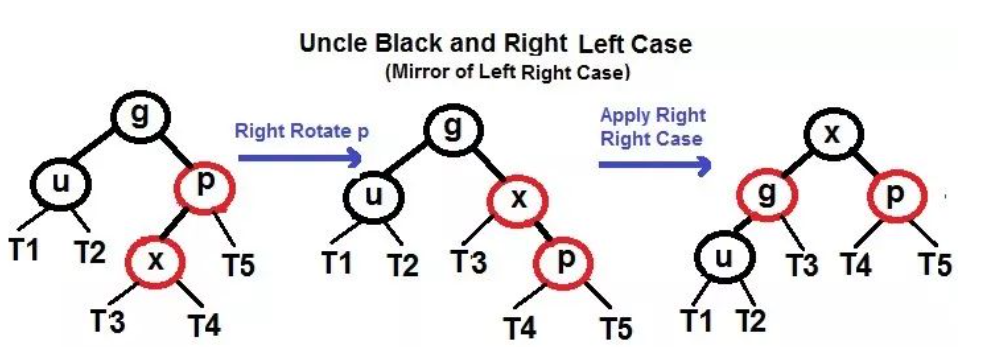
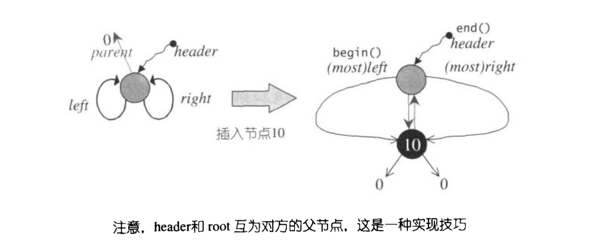

## 第十讲：rb_tree深度探索
### rb_tree vs AVL树
* AVL是一个高度平衡的二叉树，而红黑树不是
* 红黑树每次插入一个元素，最多只需要两次旋转；而AVL可能需要更多次平衡操作
* 搜索速度：AVL树更加快，因为其严格遵守高度平衡，搜索查找的平均时间复杂度为log2(n)
* 插入速度：红黑树更加快，因为最多只需要两次旋转再加一些重新着色。
* AVL树是rb_tree的子集

### 红黑树的结构
* 红黑树是平衡二分搜索树中常常使用的一种，平衡二分搜索树的特性：排列规则有利search和insert，并保持适度平衡。
* 红黑树提供遍历的功能及iterators。按正常规则（++ite）遍历，便能获得排序状态。
* 红黑树的结构样例：
  
    
    排序的状态为红黑树的中序遍历，begin()在左下，end()是在右下
* 红黑树的规则(首先需要是一颗二分查找树{BST})：
    * 1.每个节点不是红色就是黑色
    * 2.根节点为黑色
    * 3.如果节点为红，其子节点必须是黑（如果节点为黑，其子节点既可以是红也可以是黑）
    * 4.任一节点至NULL(树尾端)的任何路径，所含黑色节点数必须相同

    
    *根据规则4，新增节点必须为红；根据规则3，新增节点之父节点必须为黑，当新节点根据二叉搜索树的规则到达其插入点，
    但未能符合上述要求，就必须调整颜色并旋转树形*

* 我们不应该用红黑树的iterators改变元素值（因为元素有其严谨的排序规则）。但是编程层面并未阻止此事，rb_tree将会为set和map服务，而map允许元素的data被改变，
只有元素的key才是不能被改变的。
* rb_tree提供两种insertion操作（红黑树本身对重复与否没有限制，而取决于insert的方式）：insert_unique()和insert_equal()。前者表示节点的key一定在整个树中独一无二，
否则安插失败；后者表示节点的key可以重复。

部分源码（在这里将key和data合起来的节点合成value）：
```c++
//这里的Value是key和data的组合，如果value只传一个值说明没有value（set）
template <class Key, class Value, class KeyOfValue, class Compare,
          class Alloc = alloc>
class rb_tree {
protected:
    typedef __rb_tree_node<Value> rb_tree_node;//红黑树的结构
    ···
public:
     // 注意，没有定义iterator（喔，不，定义在后面）
    typedef rb_tree_node* link_type;//指向红黑树节点的指针
    ···
protected:
    //rb_tree只以三个资料表现它自己
    size_type node_count;//rb_tree的大小（节点数量）
    link_type header;
    Compare key_compare;//key的大小比较准则；应会是个function object
    ···
}
```

测试rb_tree（GNU2.9）:
```c++
rb_tree<int, int, identity<int>, less<int>> itree;
cout << itree.empty() << endl;//1
cout << itree.size() << endl;//0

itree.insert_unique(3);
itree.insert_unique(8);
itree.insert_unique(5);
itree.insert_unique(9);
itree.insert_unique(13);
itree.insert_unique(5);//无效，因为使用了insert_unique()函数
cout << itree.empty() << endl;//0
cout << itree.size() << endl;//5
cout << itree.count(5) << endl;//1

itree.insert_equal(5);
itree.insert_equal(5);
cout << itree.size() << endl;//7，因为使用了insert_equal()函数
cout << itree.count(5) << endl;//3
```
在GNU4.9下只是改变了名称：
```c++
_Rb_tree<int, int, identity<int>, less<int>> itree;
cout << itree.empty() << endl;//1
cout << itree.size() << endl;//0

itree._M_insert_unique(3);
itree._M_insert_unique(8);
itree._M_insert_unique(5);
itree._M_insert_unique(9);
itree._M_insert_unique(13);
itree._M_insert_unique(5);//无效，因为使用了_M_insert_unique()函数
cout << itree.empty() << endl;//0
cout << itree.size() << endl;//5
cout << itree.count(5) << endl;//1

itree._M_insert_equal(5);
itree._M_insert_equal(5);
cout << itree.size() << endl;//7，因为使用了_M_insert_equal()函数
cout << itree.count(5) << endl;//3
```

### 红黑树插入节点

红黑树插入的节点默认为红色，首先根据二叉树寻找插入的位置，再根据相对位置来调整红色和黑色，以及旋转的问题。

关于红黑树的插入问题，可以在这个[网站](https://www.cs.usfca.edu/~galles/visualization/RedBlack.html) 来手动插入试验一下！

* 关于红色和黑色节点的问题：
  * 插入节点初始一定为红色，新增节点的父节点必须为黑色，再根据rb_tree的四条规则进行调整。
* 关于旋转，先看一个实例：
  
* 红黑树旋转的具体规则如下(假设插入的节点为X)：
  1. 将新插入的节点标记为红色
  2. 如果 X 是根结点(root)，则标记为黑色（2⃣️）
  3. 如果 X 的 parent 不是黑色，同时 X 也不是 root（3⃣️）:
     * 如果 X 的 uncle (叔叔) 是红色：
       1. 将 parent 和 uncle 标记为黑色
       2. 将 grand parent (祖父) 标记为红色
       3. 让 X 节点的颜色与 X 祖父的颜色相同，然后重复步骤2⃣️3⃣️
       
       *图中的g节点最后为黑色，因为是根节点*
     * 如果 X 的 uncle (叔叔) 是黑色，我们要分四种情况去处理：
       1. 左左 (P 是 G 的左孩子，并且 X 是 P 的左孩子)：
       
       **想象这是一根绳子，手提起 P 节点，然后变色即可**
       2. 左右 (P 是 G 的左孩子，并且 X 是 P 的右孩子)：
       
       **左旋: 使 X 的父节点 P 被 X 取代，同时父节点 P 成为 X 的左孩子，然后再应用左左情况**
       3. 右右 (和 3.2.1 镜像过来，恰好相反)：
       
       **与左左情况一样，想象成一根绳子**
       4. 右左 (和 3.2.2 镜像过来，恰好相反)：
       
       **右旋: 使 X 的父节点 P 被 X 取代，同时父节点 P 成为 X 的右孩子，然后再应用右右情况**
     

### 红黑树的迭代器

* rb_tree迭代器属于双向迭代器，但不具备随机定位功能，其提领操作和成员访问操作和list十分接近！
* rb_tree的前进操作`operator++()`调用了基层的`increment()`,后退操作`operator--()`调用了`decrement()`。

源码如下：
```c++
// 以下其實可實作於 operator++ 內，因為再無他處會呼叫此函式了。
  void increment()
  {
    if (node->right != 0) {		// 如果有右子節點。狀況(1)
      node = node->right;		// 就向右走
      while (node->left != 0)	// 然後一直往左子樹走到底
        node = node->left;		// 即是解答
    }
    else {					// 沒有右子節點。狀況(2)
      base_ptr y = node->parent;	// 找出父節點
      while (node == y->right) {	// 如果現行節點本身是個右子節點，
        node = y;				// 就一直上溯，直到「不為右子節點」止。
        y = y->parent;
      }
      if (node->right != y)		// 「若此時的右子節點不等於此時的父節點」。
        node = y;				// 狀況(3) 此時的父節點即為解答。
                                      // 否則此時的node 為解答。狀況(4)
    }						
    // 注意，以上判斷「若此時的右子節點不等於此時的父節點」，是為了應付一種
    // 特殊情況：我們欲尋找根節點的下一節點，而恰巧根節點無右子節點。
    // 當然，以上特殊作法必須配合 RB-tree 根節點與特殊之header 之間的
    // 特殊關係。
  }

  // 以下其實可實作於 operator-- 內，因為再無他處會呼叫此函式了。
  void decrement()
  {
    if (node->color == __rb_tree_red &&	// 如果是紅節點，且
        node->parent->parent == node)		// 父節點的父節點等於自己，
      node = node->right;				// 狀況(1) 右子節點即為解答。
    // 以上情況發生於node為header時（亦即 node 為 end() 時）。
    // 注意，header 之右子節點即 mostright，指向整棵樹的 max 節點。
    else if (node->left != 0) {			// 如果有左子節點。狀況(2)
      base_ptr y = node->left;			// 令y指向左子節點
      while (y->right != 0)				// 當y有右子節點時
        y = y->right;					// 一直往右子節點走到底
      node = y;						// 最後即為答案
    }
    else {							// 既非根節點，亦無左子節點。
      base_ptr y = node->parent;			// 狀況(3) 找出父節點
      while (node == y->left) {			// 當現行節點身為左子節點
        node = y;						// 一直交替往上走，直到現行節點
        y = y->parent;					// 不為左子節點
      }
      node = y;						// 此時之父節點即為答案
    }
  }
};
```
operator呼叫：
```c++
self& operator++() { increment(); return *this; }
  self operator++(int) {
    self tmp = *this;
    increment();//呼叫
    return tmp;
  }
    
  self& operator--() { decrement(); return *this; }
  self operator--(int) {
    self tmp = *this;
    decrement();//呼叫
    return tmp;
  }
};
```

### 红黑树的数据结构
红黑树最主要的组成部分就是节点，每个节点的class包括的成员有`left`,`right`,`parent`,`value`,`key`,`color`!

### 红黑树的构造和内存管理
rb_tree的构造方式有两种，一种是以现有的rb_tree复制一个新的rb_tree，另一种是产生一颗新的空树。

* rb_tree的默认构造：
```c++
rb_tree(const Compare& comp = Compare())
    : node_count(0), key_compare(comp) { init(); } 
```
其中init操作：
```c++
private:
    void init() {
        header = get_node();//产生一个节点空间，令header指向它
        color(header) = __rb_tree_red;//令header为红色，用来区分header和root
        
        root() = 0;
        leftmode() = header;//令header的左子节点为自己
        rightmode() = header;//令header的右子节点为自己
    }
```
#### rb_tree的边界问题
这里的边界问题就是走到根节点时需要有特殊的处理。为了简化处理，sgi stl为根节点再设计了一个父节点，名为header，初始状态如下图所示：



### rb_tree的元素操作
* 元素插入：`insert_equal()`代表插入值可以重复；`insert_unique()`代表插入值不可以重复。
* 元素的搜索：主要为find()函数，我们主要使用其上层的set和map容器进行搜索。