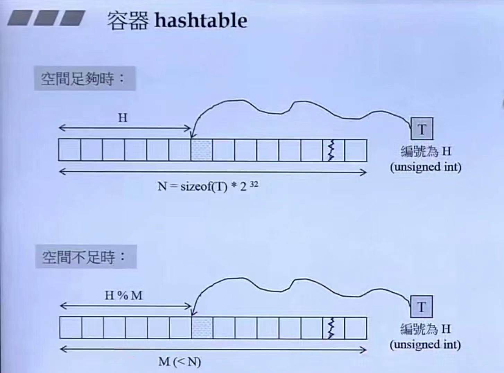
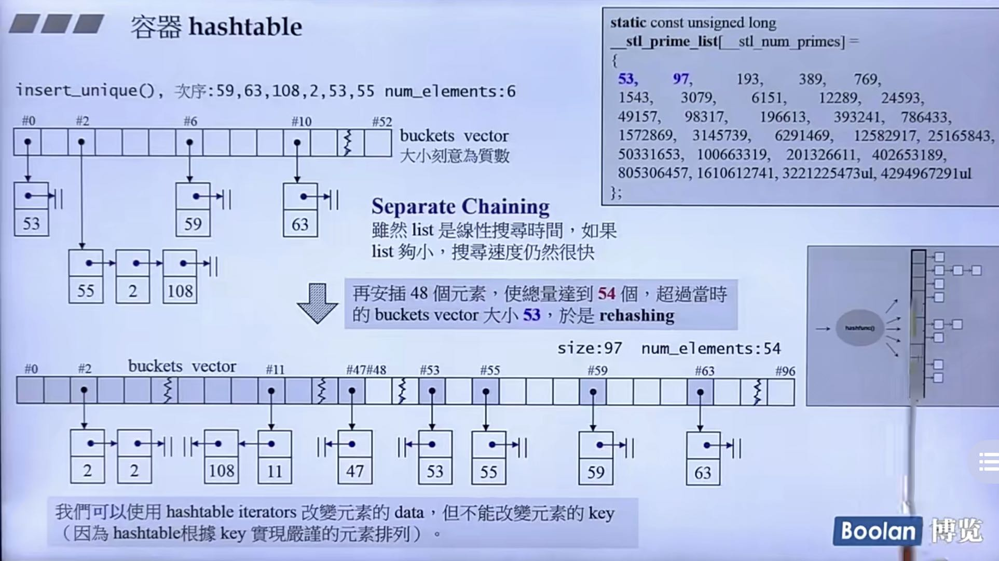
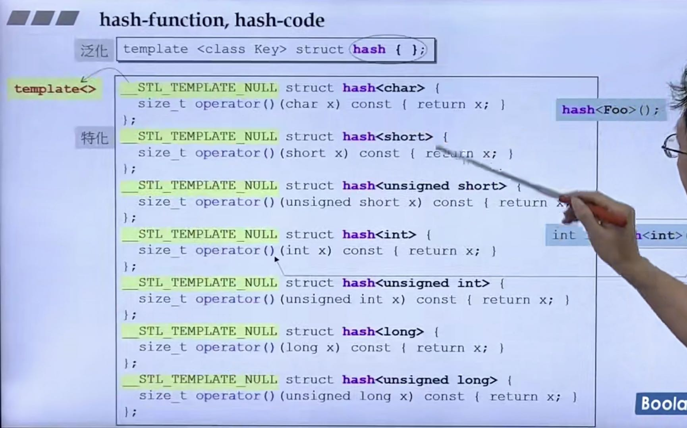

## 第十二讲：hashtable深度探索
### 为什么要使用hashtable？


如上图所示，如果空间足够，我们当然可以按照次序进行存储，但往往存储是比较有限的，我们就可以使用
hashtable的结构来存储！

### 如何处理hashtable的碰撞现象？
如果我们使用hashtable的结构，一定会存在取余之后相等的情况：例如`15%7`和`22%7`就会发生碰撞！

我们解决的办法是：**如果发生碰撞，就将它们以一个链表的形式串在一起，如下图所示。**



特点：
* 发生碰撞时使用形成链表的形式来解决碰撞。
* 链表的搜寻时间是线性增长的（ 平均时间复杂度为O(n) ），但如果list够小，搜寻的速度荏苒很快。
* 如果所有链表的总节点数超过了`bucket`（这里指模的值，图中为53，也是GNU中使用的初始值）的数量， 采用`再哈希`的方法:
    * 方式为将`bucket`的数量扩充到原来的值的2倍，然后选取离它最近的素数作为新的`bucket`值。
    * 每次扩充都需要对每个元素重新计算新的位置。
    * 在源码中已经将所有`bucket`的值全部算好了，需要扩充时，直接取就ok！

* hashtable部分源码（GNU2.9）：
    ```c++
    template <class Value, class Key, class HashFcn,
              class ExtractKey, class EqualKey,
              class Alloc> 	
    class hashtable {
    public: 
        //将传进来的参数重新换了一个名称
        typedef HashFcn hasher;
        typedef EqualKey key_equal;
        typedef size_t            size_type;
    private:
        // 以下三者都是function objects。<stl_hash_fun.h> 中定義有數個
        // 標準型別（如int,c-style string 等）的hasher。
        hasher hash;	
        key_equal equals;
        ExtractKey get_key;
    
        typedef __hashtable_node<Value> node;
        vector<node*,Alloc> buckets;	// bucket代表能拉出链表的每个缓存，buckets用 vector 完成
        size_type num_elements;
    public:
        size_type bucket_count() const {return buckets.size();}
        ...
    };
    ```
    其中`__hashtable_node`的定义如下：
    ```c++
    template<class Value> struct __hashtable_node {
        __hashtable_node* next;
        Value val;
    };
    ```

* hashtable的字节数：20个Bytes
    * 闯入的3个参数占用3个字节
    * `buckets`占用12个Bytes：因为buckets使用vector实现，前面我们说过每个vector本身维护
  三个泛化指针，而每个指针占用4个Bytes。
    * `num_elements`为size_type类型，代表元素的个数，类似于`unsigned_interger`占用4个Bytes。
    * 总共占用19个Bytes，因为要符合内存对齐的原则，将其调整为4的倍数20Bytes。

    * hashtable的迭代器设计：
        * 在VC中链表采用双向链表的方式，使得链表走到边界的时候有能力回到原来的位置。
        * 在GNU2.9中则维护两个指针的方式来运行，一个为`node`类型的cur指针,指向当前在链表中的位置，另一个
      为`hashtable`类型的ht指针，指向当前多处的`bucket`的位置。部分源码如下：
        ```c++
        template<class Value, class Key, class HashFcn,
              class ExtractKey, class EqualKey,
              class Alloc>
      struct __hashtable_iterator {
          ...
          node* cur;
          hashtable* ht;
      };
      ```
      
### 尝试使用hashtable
demo：
```c++
hashtable<const char*, 
                const char*,
                hash<const char*>,
                identity<const char*>,//如何从value中取出key的规则（这里key就为value）
                eqstr,//是一个仿函数，代表比较的规则，使其比较的对象变成指针指向的内容，而不是指针本身
                alloc>
ht(50, hash<const char*>(), eqstr());

//不重复的插入
ht.insert_unique("kiwi");
ht.insert_unique("plum");
ht.insert_unique("apple");
```
其中`eqstr`如下(这里使用了c风格的字符串`char*`，所以需要另外定义比较的规则)：
```c++
/*比较c-string是否相等，有strcmp()可以使用，但它传回-1，0，1，不是传回bool，
所以必须加一层外套*/

struct eqstr {
    bool operator()(const char* s1, const char* s2)const
    { return strcmp(s1, s2) == 0; }
};
```
其中`hash`使用了类似于下图的偏特化：


它的作用是执行`hash-function`：希望根据元素之算出一个`hash-code`,也可以说将传入的数值转化为编号，
使得元素经过`hash_code`（这里其实是前面所讲的模的值）映射之后能够足够乱，尽量不会发生碰撞！

比如s为"abc"，那么计算得到的h值为`5*（5 * 'a' + 'b'）+ 'c'`

*注意标准库没有提供`hash<std::string>`*

### modules运算
所谓modules运算就是计算元素值要落在**哪个bukcet**的链表上。
目前都使用`{ return hash(key) % n; }`


