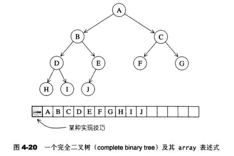
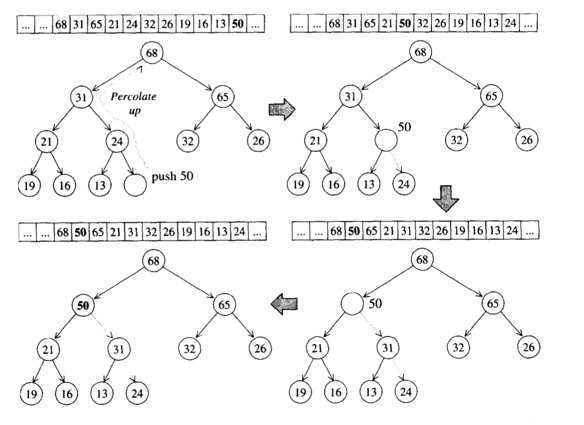
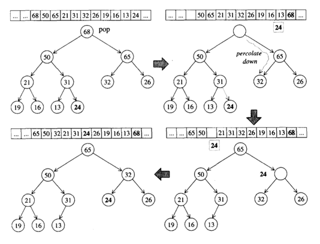
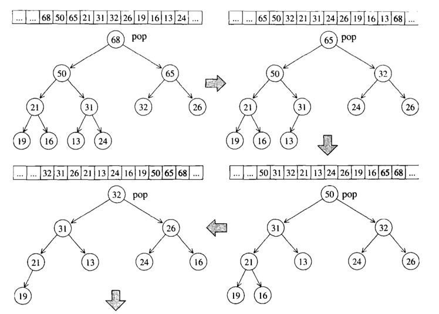
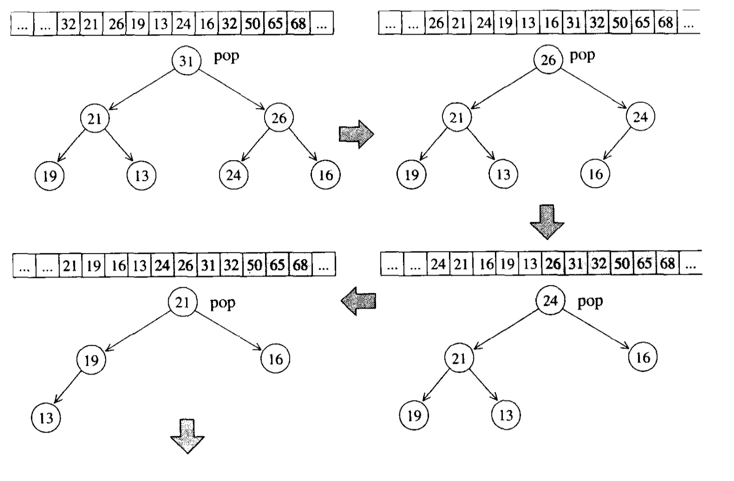
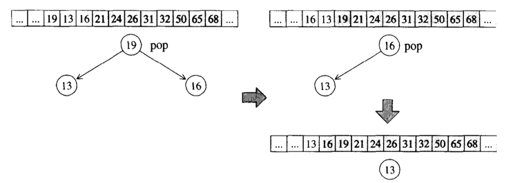
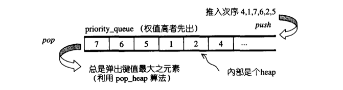

## 第十三讲：heap&priority_queue深入探索
### heap概述
heap不是STL容器组件，它是扮演`priority queue`的助手。`priority queue`允许用户以任何次序将任何元素推入容器中，
但取出时一定是从优先权最高的元素开始取。`binary max heap`正具有这样的特性，适合作为`priority queue`的底层机制。

`priority queue`选用`binary heap`来实现，它是一种`完全二叉树`，也就是说除了最底层的叶子节点之外，是填满的，且
最底层的叶节点由左至右不能右空隙。因为整棵树没有任何节点漏洞，我们可以使用array来存储所有的节点。
> binary heap是一颗完全二叉树，那么它就具备完全二叉树的特点：当某个节点位于array的i处，其左子节点必位于array的
2i处，其右子节点一定位于array的2i+1处，其父节点必定位于"i/2"处。

`binary heap`使用一个array（保存数据）和一组heap算法（用来插入元素、删除元素、取极值）。这种使用array表述
tree的方式，被称为`隐式表达`。

 

当然heap要能动态的改变大小，所以用vector存储数据会更好。
> heap可以分为max-heap以及min-heap，前者每个节点的键值都大于或等于其子节点键值，后者的每个节点键值都小于或
等于其子节点键值。可以推出，max-heap的最大键值在根节点，min-heap的最小键值在根节点。

### heap算法
#### push_heap算法
在很多书籍当中，通常通过一个上浮的操作来完成push_heap。其基本原理可见下图（假设新加入的元素是50）：



1.将50插入到数组的末尾。

2.将其于父元素相比较，发现24小于50，交换这两个元素。上浮一次

3.继续上述操作直到找到一个合适的位置，也即其父元素大于50的位置，则上浮结束。

一个简易的c++实现：
```c++
template<typename T>
void push_heap(std::vector<T> &vec, T value)
{
	vec.push_back(value);
	int i = vec.size()-1;
	while (i > 1 && vec[i] > vec[i / 2]) {
		std::swap(vec[i], vec[i / 2]);
		i = i / 2;
	}
}
```
#### pop_heap算法
pop操作是类似的：

 

1.将最后一个元素与第一个元素（根元素）交换。

2.删除最后一个元素。

3.将第一个元素/根元素下沉到一个合适的位置。**注意下沉的时候是与子节点较大的那个元素交换**。

一个简单的c++实现：
```c++
template<typename T>
T pop_heap(std::vector<T> &vec)
{
	int i = 1;
	//将最后元素与第一个元素(根元素)交换, 然后删除最后一个元素
	std::swap(vec[1], vec[vec.size() - 1]);
	T v = vec[vec.size() - 1];
	vec.pop_back();

	//将现在的第一个元素/根元素下沉到一个合适的位置
	while (2 * i < vec.size()) {
		int j = 2 * i;	//左子节点
		if (j < vec.size() - 1 && vec[j] < vec[j + 1]) j++;
		if (vec[j] < vec[i]) break;
		std::swap(vec[i], vec[j]);
		i = j;
	}
	return v;
}
```
#### sort_heap算法
既然每次`pop_heap`可获得`heap`中键值最大的元素，如果持续对整个`heap`做`pop_heap`操作，
每次将操作范围从后向前缩减一个元素（因为`pop_heap`会把键值最大的元素放在底部容器的最尾端），
当整个程序执行完毕时，我们便有了一个递增序列。下图所示的是`sort_heap`的实际操演情况。





> 可以看到不断对heap进行pop操作，便可达到排序效果

一个简单的c++实现：
```c++
template<typename T>
void sort_heap(std::vector<T> &vec)
{
	std::vector<T> temvec;
	int size = vec.size()-1;
	while (size != 0) {
		temvec.push_back(pop_heap(vec));
		size--;
	}
	for (T value : temvec) {
		vec.push_back(value);
	}
}
```
#### make_heap算法
这个算法是将一段现有的数据转化为一个heap，主要依据就是前面所说的`隐式表达`。

#### heap没有迭代器
因为heap的结构是一个完全二叉树，类似于红黑树，我们都不能对它进行遍历，这样会造成heap结构的破坏，因此它也就没有迭代器。

### priority_queue
#### priority_queue概述
`priority_queue`是一个拥有权值观念的`queue`，允许加入新元素，移除旧元素。**但由于这是一个queue，所以只允许在底端
加入元素，在顶端取出元素。**

`priority_queue`带有权值观念，其内的元素按照元素的权值来排列（通常权值以实值表示）。默认权值最高者，排在最前面。

缺省状态下的`priority_queue`利用一个`max_heap`实现，由一个使用`vector`表现的完全二叉树，结构如下：



#### priority_queue定义完整列表

前面说的缺省状态下就是默认的优先队列形式，底部容器为vector加上堆的处理规则。我们修改某些借口，就会形成不同的特性，
具有这种性质者，被称为配接器。


源码如下（GNU2.9）：
```c++
#include <iostream>
#include <vector>
 
#ifdef __STL_USE_EXCEPTIONS
#define __STL_TRY   try
#define __STL_UNWIND(action)   catch(...) { action; throw; }
#else
#define __STL_TRY
#define __STL_UNWIND(action)
#endif
 
 
template <class T,class Sequence = std::vector<T>,
          class Compare = std::less<typename Sequence::value_type>>
class priority_queue{
public:
    typedef typename Sequence::valuetype value_type;
    typedef typename Sequence::size_type size_type;
    typedef typename Sequence::reference reference;
    typedef typename Sequence::const_reference const_reference;
protected:
    Sequence c; //底层容器
    Compare comp; //元素大小的比较标准
public:
    priority_queue() : c (){}
    explicit priority_queue(const Compare& x) : c() ,comp(x){}
    //以下使用的make_heap()、push_heap()、pop_heap()都是泛型算法
    //注意 任意一个构造函数都立刻在底层容器内产生一个implicit representation heap
    //指代比较器
    template<class InputIterator>
    priority_queue(InputIterator first, InputIterator last,const Compare& x):
    c(first,last),comp(x){
        std::make_heap(c.begin(),c.end(),comp);
    }
    //没有指代比较器
    template<class InputIterator>
    priority_queue(InputIterator first, InputIterator last):
            c(first,last){
        std::make_heap(c.begin(),c.end(),comp);
    }
    bool empty()const{
        return c.empty();
    }
    size_type size() const{
        return c.size();
    }
    const_reference top()const{
        return c.front();
    }
    void push(const value_type& x){
        __STL_TRY{
            //push_heap 是泛型算法，先利用底层的push_back()将新的元素推入末端，再重新排列heap
            c.push_back(x);
            //push_heap 是泛型算法
            std::push_heap(c.begin(),c.end(),comp);
        }
        __STL_UNWIND(c.clear());
    }
    void pop(){
        __STL_TRY{
            //pop_heap是泛型算法，从heap中取出一个元素，并不是整整将这个元素弹出，而是重排heap
            //需要使用底层vector的pop_back()取得被弹出的元素
            std::pop_heap(c.begin(),c.end(),comp);
            c.pop_back();
        }
        __STL_UNWIND(c.clear());
    }
 
};
```

#### priority_queue的用法
* 第一种：只定义一个参数，默认形式下，这里是一个关于字符串的大顶堆（按字符串的第一个字符排，最大的在第一位）
```c++
priority_queue<string> pq;//也可以是 int,char等
```
* 第二种：改变第三个模板参数，实现小顶堆。
```c++
priority_queue<int,vector<int>,less<int>> pq;
```
* 第三种：当第一个模板参数是自定义数据时，就需要自定义一个比较方式，可以是一个函数对象，可以是一个函数
  （一般采用lamda表达式，因为它需要使用当前函数的传入参数，但又不能在函数体内定义函数，故采用这样的方式）。
    * 采用函数对象（仿函数）作为第三个模板参数。指定第三个模板参数是cmp类型：
  
  ```c++
  struct Node{//也可以是class
      int x,y;
      Node(int a=0, int b=0):
      x(a), y(b) {}
  };
  
  struct cmp{//也可以是class
      bool operator()(Node a, Node b){
          if(a.x == b.x)	return a.y>b.y;
          return a.x>b.x;
          }
      };
  
  int main(){
      priority_queue<Node, vector<Node>, cmp>p;
      for(int i=0; i<10; ++i)
          p.push(Node(rand(), rand()));
  		
  	while(!p.empty()){
  	    cout<<p.top().x<<' '<<p.top().y<<endl;
  	    p.pop();
  	}
  	return 0;
  }
  ```
  
  * 实现一个第三个参数为函数指针的`priority_queue`,重点是decltype(cmp)和 pq(cmp）的使用方式。
    个人理解是声明cmp函数（实际是以指针）为一个指针类，从而作为模板参数，并在命名的时候使用pq(cmp):
  
  ```c++
   vector<vector<int>> kSmallestPairs(vector<int>& nums1, vector<int>& nums2, int k){
    auto cmp=[&](const pair<int, int>& lhs, const pair<int, int>& rhs){
              return nums1[lhs.first] + nums2[lhs.second] > nums1[rhs.first] + nums2[rhs.second];
  //当后面进来下标pair对rhs下：nums1[rhs.first] + nums2[rhs.second]小时，将这个rhs和lhs置换，实现小顶堆
          };
  	priority_queue<pair<int, int>, vector<pair<int, int>>, decltype(cmp)> pq(cmp);
  }
  ```
  
  
> 注意因为priority_queue是由底层容器+heap规则实现的，所以priority_queue也没有迭代器。