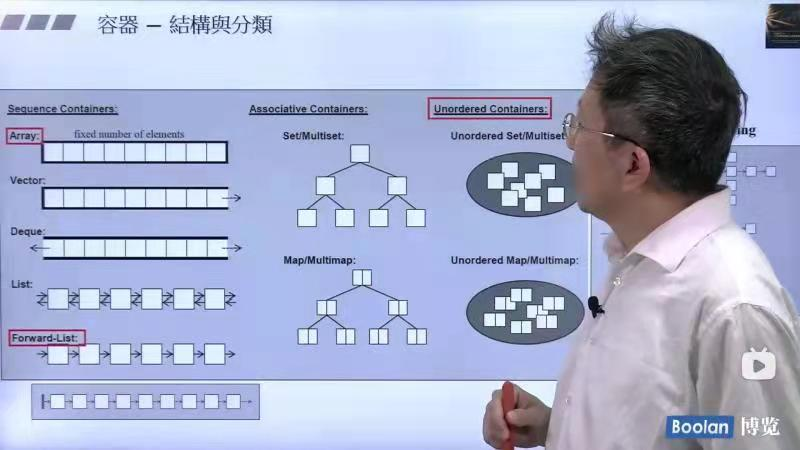
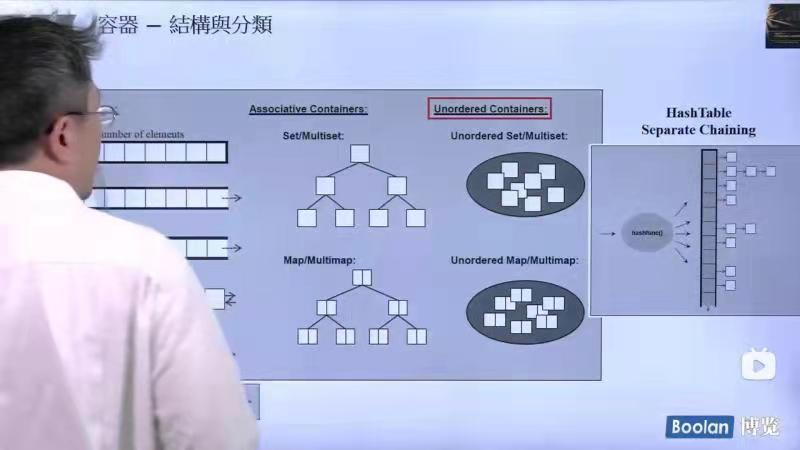
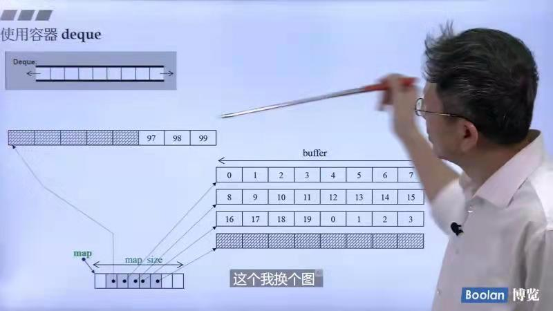
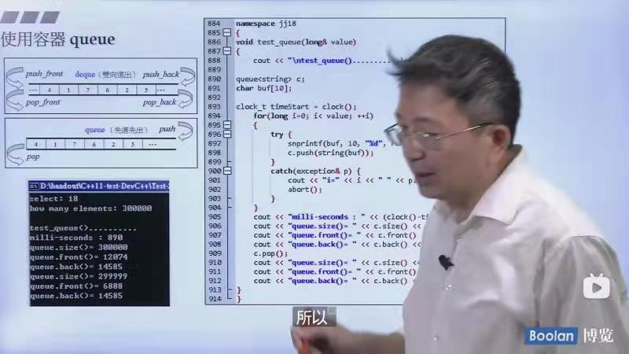
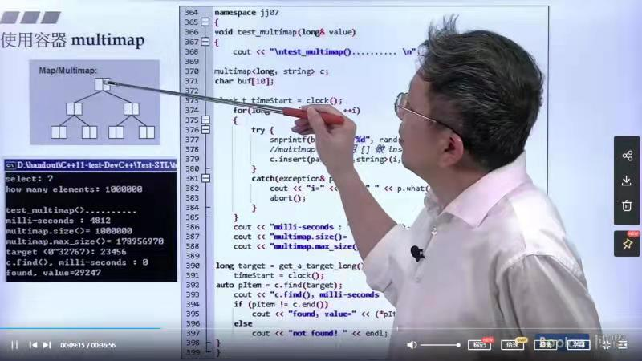
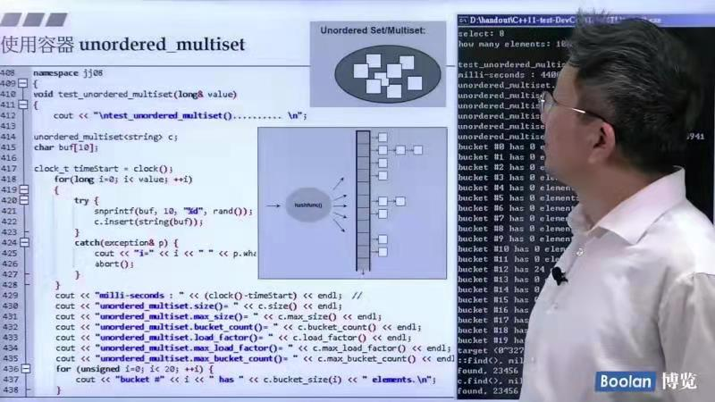
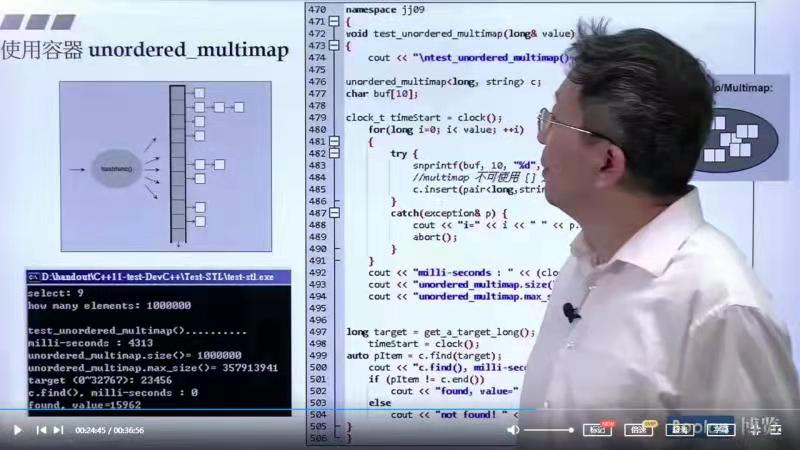
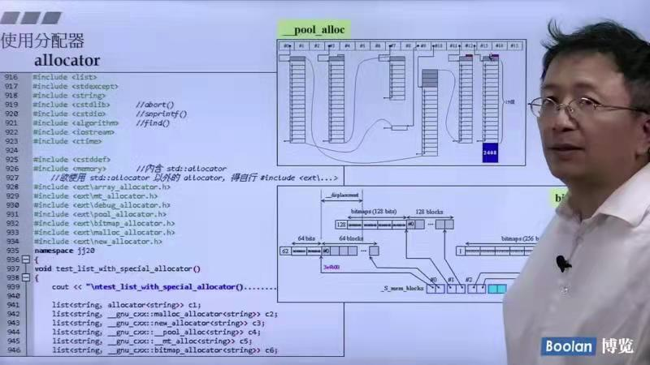
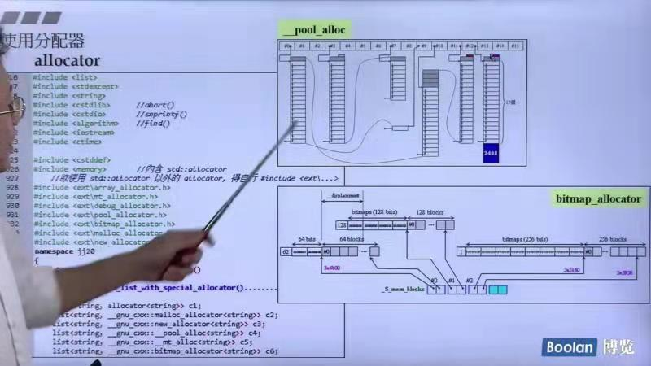

## 第二讲:容器之分类及各种测试

### 容器结构及分类





* 序列式容器
    * 数组（Array）：定长数组，无法扩充
    * vector：可扩充的数组（分配器做内存扩充）
    * Deque：双端队列
    * List：双向链表
    * Forward-List：单向链表
* 关联式容器（key->value）
    * Set/Multiset（Multiset中的值可以重复）：内部为红黑数
    * Map/Multimap（Multimap中的value值可以重复）：内部为红黑树
* 无序容器（unordered,大类上属于关联式容器）

*介绍一个常用的结构hashtable：根据公式进行分类， 但会产生碰撞，
产生碰撞的元素全部放在一个链表中。但如果链表太长如何做呢？后面会继续介绍。*

先写用于测试的几个辅助函数:
```c++
using std::cin;
using std::cout;
using std::string;

long get_a_target_long()
{
    long target = 0;
    cout << "target (0~" << RAND_MAX << "):";
    return target;
}

string get_a_target_string()
{
    long target = 0;
    char buf[10];
    cout << "target (0~" << RAND_MAX << "):";
    cin >> target;
    //snprintf功能为格式化成字符串
    // 1-- 目标字符串 2 -- 拷贝字节数 3 -- 格式化成字符串。4 -- 可变参数。
    snprintf(buf, 10, "%d", target);
    return string(buf);
}
//比较两个long数据是否相等
int compareLongs(const void* a, const void* b)
{
    return (*(long*)a - *(long*)b);
}
//比较两个string数据是否相等
int compareStrings(const void* a, const void* b)
{
    if(*(string*)a > *(string*)b)
        return 1;
    else if(*(string*)a < *(string*)b)
        return -1;
    else
        return 0;
}
```

### 顺序容器使用及测试
* 使用容器array：[array.cpp](https://github.com/caixiongjiang/STL_sourcecode/blob/master/%E7%AC%AC%E4%BA%8C%E8%AE%B2/array.cpp)
* 使用容器vector：[vector.cpp](https://github.com/caixiongjiang/STL_sourcecode/blob/master/%E7%AC%AC%E4%BA%8C%E8%AE%B2/vector.cpp)
* 使用容器list：[list.cpp](https://github.com/caixiongjiang/STL_sourcecode/blob/master/%E7%AC%AC%E4%BA%8C%E8%AE%B2/list.cpp)
* 使用容器forward_list：[forward_list.cpp](https://github.com/caixiongjiang/STL_sourcecode/blob/master/%E7%AC%AC%E4%BA%8C%E8%AE%B2/forward_list.cpp)
* 使用容器slist：[slist.cpp](https://github.com/caixiongjiang/STL_sourcecode/blob/master/%E7%AC%AC%E4%BA%8C%E8%AE%B2/slist.cpp)
* 使用容器deque：[deque.cpp](https://github.com/caixiongjiang/STL_sourcecode/blob/master/%E7%AC%AC%E4%BA%8C%E8%AE%B2/deque.cpp)
  * deque容器的结构：
  
  
  
  deque容器由一个个具有一定长度的buffer组成，在每一个buffer上是连续的，
但是buffer与buffer之间不是连续的。（也就是所谓的**分段连续**的特点）
  
  deque内存扩充的机制是向两边扩充：哪边不够用了就扩充一下，每次都扩充一个buffer。
### 关联式容器使用及测试
**注意一点，只要是关联式的容器它的查找效率都是非常高的！**
* 使用容器stack：[stack.cpp](https://github.com/caixiongjiang/STL_sourcecode/blob/master/%E7%AC%AC%E4%BA%8C%E8%AE%B2/stack.cpp)
  
  deque其实已经涵盖了stack的功能：
  
  
* 使用容器queue：[queue.cpp](https://github.com/caixiongjiang/STL_sourcecode/blob/master/%E7%AC%AC%E4%BA%8C%E8%AE%B2/queue.cpp)
  
  deque其实已经涵盖了queue的功能：

  

### 关联性容器使用及其测试
* 使用容器multiset：[multiset.cpp](https://github.com/caixiongjiang/STL_sourcecode/blob/master/%E7%AC%AC%E4%BA%8C%E8%AE%B2/multiset.cpp)
  * multiset的结构：
  
  
* 使用容器multimap：[multimap.cpp](https://github.com/caixiongjiang/STL_sourcecode/blob/master/%E7%AC%AC%E4%BA%8C%E8%AE%B2/multimap.cpp)
  * multimap的结构：
  
  
* 使用容器unordered_multiset：[unordered_multiset.cpp](https://github.com/caixiongjiang/STL_sourcecode/blob/master/%E7%AC%AC%E4%BA%8C%E8%AE%B2/unordered_multiset.cpp)
  * unordered_multiset的结构：
  
  
* 使用容器unordered_multimap：[unordered_multimap.cpp](https://github.com/caixiongjiang/STL_sourcecode/blob/master/%E7%AC%AC%E4%BA%8C%E8%AE%B2/unordered_multimap.cpp)
  * unordered_multimap的结构：

  
* 使用容器set：[set.cpp](https://github.com/caixiongjiang/STL_sourcecode/blob/master/%E7%AC%AC%E4%BA%8C%E8%AE%B2/set.cpp)
  * set的结构：和前面的multiset相同（为红黑树）
* 使用容器map：[map.cpp](https://github.com/caixiongjiang/STL_sourcecode/blob/master/%E7%AC%AC%E4%BA%8C%E8%AE%B2/map.cpp)
  * map的结构：和前面的multimap相同（为红黑树，每个节点有两个值组合起来）
  
* 使用容器unordered_set：[unordered_set.cpp](https://github.com/caixiongjiang/STL_sourcecode/blob/master/%E7%AC%AC%E4%BA%8C%E8%AE%B2/unordered_set.cpp)
  * unordered_set的结构：和前面的unordered_multiset相同，底层为hashtable
* 使用容器unordered_map：[unordered_map.cpp](https://github.com/caixiongjiang/STL_sourcecode/blob/master/%E7%AC%AC%E4%BA%8C%E8%AE%B2/unordered_map.cpp)
  * unordered_map的结构：和前面的unordered_multimap相同，底层为hashtable

注：
* *priority_queue和heap是以其他的容器做底部支撑的，所以没有进行归类。*
* *hash_set 等价于unordered_set*
* *hash_map 等价于unordered_map*
* *hash_multiset 等价于unordered_multiset*
* *hash_multimap 等价于unordered_multimap*
* *hash_~的头文件是放在特殊的头文件中，是在特殊的文件夹中*

### 分配器使用及其测试

分配器自身是用管理内存使用的，我们平常使用很少，一般直接使用容器里默认的分配器（可以省略），也就是说我们会直接使用容器。




