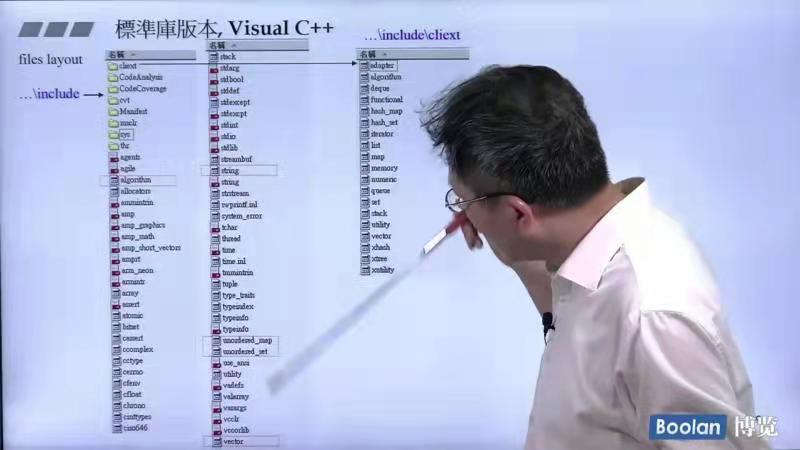
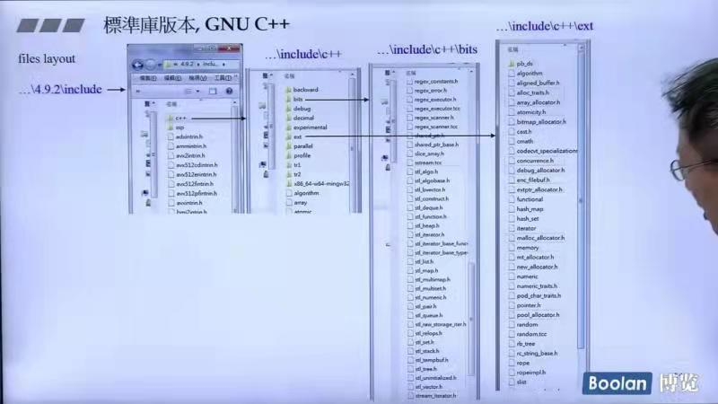
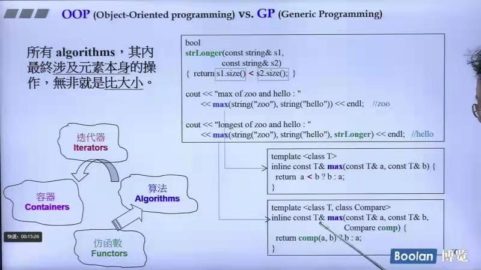
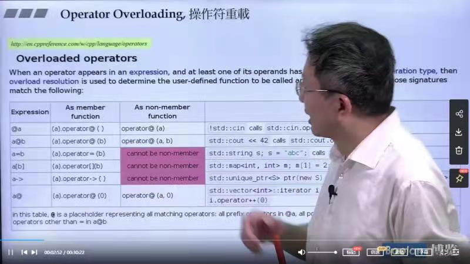
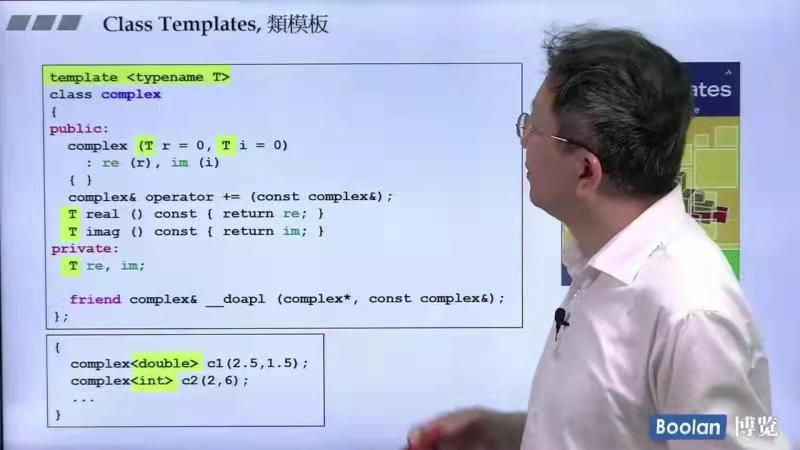
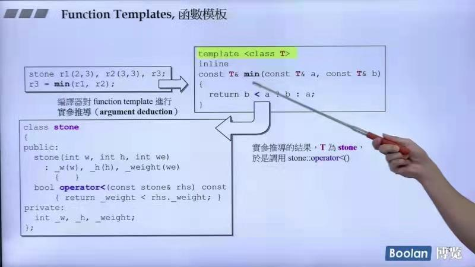
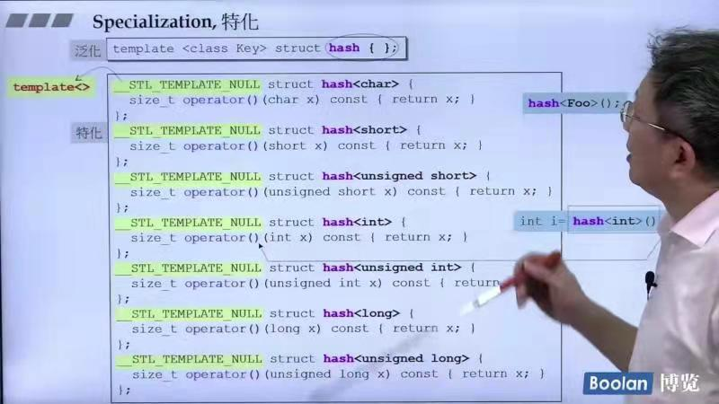
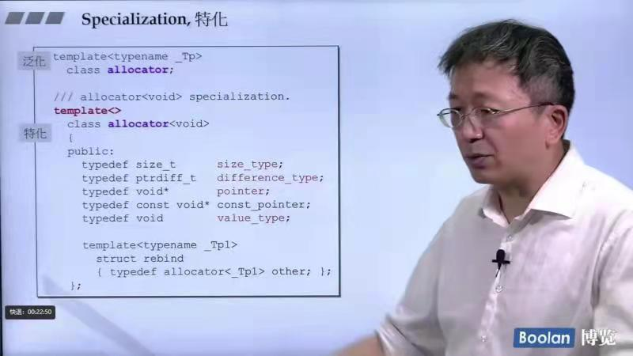
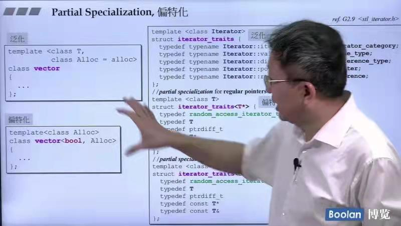
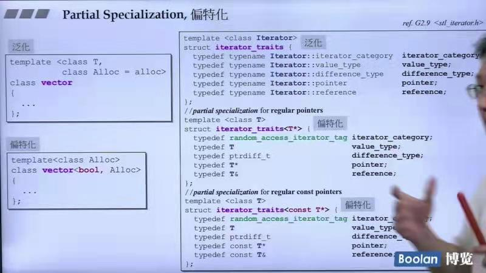

## 第三讲:泛型编程和模版技术

### 源代码之分布

* VC的标准库文件夹:


* GNU c++标准库文件夹:



### OOP(面向对象编程) vs GP(泛型编程)

* OOP将datas和methods关联在一起（成员变量和成员函数都放在类里面）
    demo:list内部本身存在有sort()算法，使用语法如下：
    ```c++
    c.sort()
    ```
* GP是将datas和methods分开来
    
    demo：vector和deque内部都没有sort()函数，sort()函数是放在算法里面的，使用语法如下：
    ```c++
    ::sort(c.begin(), c.end());
    ```
    注：*list本身是链式容器，无法支持随机访问，所以需要本身自己重新定义sort()。*

* 采用GP的好处：
    * 容器和算法团队可以各自写自己的东西，其间用迭代器来进行关联。
    * 算法通过迭代器确定操作范围，并通过迭代器取用容器的元素。
    * 两个石头如何比较大小不需要类来决定，而是用仿函数来决定。
* max()算法的demo：
  
  
  
  第二个版本的参数3接收的是**函数对象**或者是**仿函数**，**用于自定义的比较规则制定**！

### 操作符重载复习
操作符操作单个数或者多个数，以及能否成为类内部的成员函数



### 模版Template复习

* 类模版:


* 函数模版:


* 成员模版

#### 模版中泛化 vs 特化
* 泛化的特点是可以接收大多数type的数据结构
* 特化的特点是为了某些特殊的数据（数据有不同的特点）进行的模版中特殊化的写法

demo:





#### 特化中的偏特化（局部特化）

* 个数的偏特化:


* 范围的偏特化：

