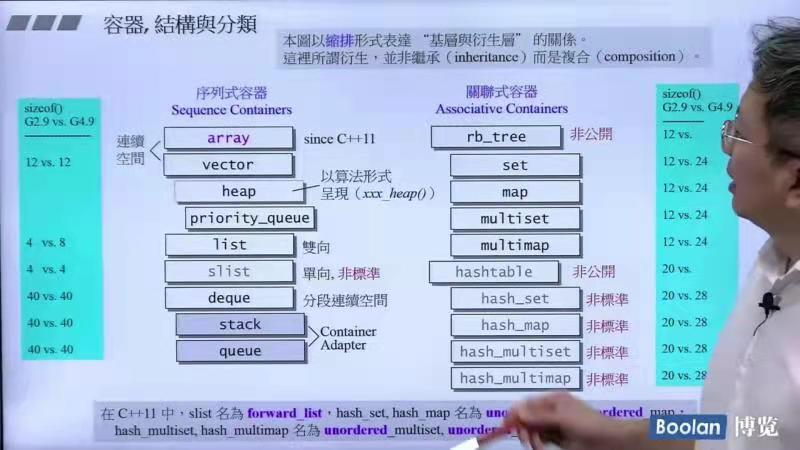
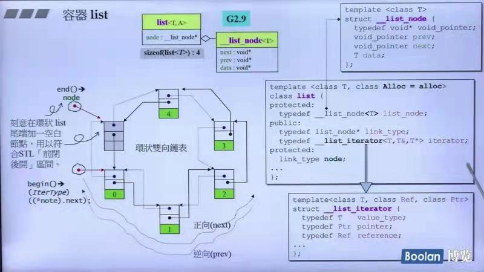

## 第五讲：深入理解容器

### 容器的结构再分类



* heap 和 priority_queue中有vector的结构
* stack 和 queue中有deque的结构
* set 和 map系列有rb_tree的结构
* unordered系列容器中有hashtable的结构
* 在c++11中：slist --> forward_list； hash_~ --> unordered_~。

### 深度探索list



list（环状双向链表）其本身是一个指针，指向一个node节点，其结构为两个指针（一个向前一个向后）+数据值
```c++
sizeof(list<int>()) //其值为4Bytes（GNU2.9） 8Bytes(GNU4.9)
```

#### list的结构

* node的设计（GNU2.9）：
```c++
tempalate<class T>
struct __list_node {
    typedef void* void_pointer;//一个空的指针置于尾端的一个空白节点，符合"前闭后开"的要求
    void_pointer prev;//向前的指针
    void_pointer next;//向后的指针
    T data;//数据
};
```

* iterator的设计（GNU2.9）：
```c++
tempalte<class T, class Ref, class Ptr>
struct __list_iterator {
    typedef T value_type;
    typedef Ptr pointer;
    typedef Ref reference;
    ···
    //具体看《STL源码剖析》p131
};
```

G4.9相较于G2.9：
* 模版参数直有一个（易于理解）
* node结构有其parent
* node的成员的type比较精准

#### list的构造和内存管理

* 当我们以push_back()将新元素插入于list尾端时，此函数内部调用insert():
```c++
void push_back(const T& x) { insert(end(), x); } 
```
而其中重载的insert的源码：
```c++
//插入的方法为前插法
//函数目的：在迭代器positon的所指位置插入一个节点，内容为x
iterator insert(iterator position, const T& x) {
    link_type tmp = create_node(x);//产生一个节点
    //调整双向指针
    tmp->next = position.node;
    temp->prev = position.node->prev;
    (link_type(positon.node->prev))->next = tmp;
    return tmp;
}
```
**由于list不像vector那样有可能在空间不足时做重新配置，数据移动的操作，所以插入前的所有迭代器在插入后都仍然有效！**

#### list的元素操作

push_front(), push_back(), erase(), pop_front(), pop_back(), clear(), remove(), unique(),splice()
merge(), reverse(), sort()
*unique()作用为移除相同的连续元素，移除到只剩一个*
具体源码看《STL源码剖析》p136～p142
