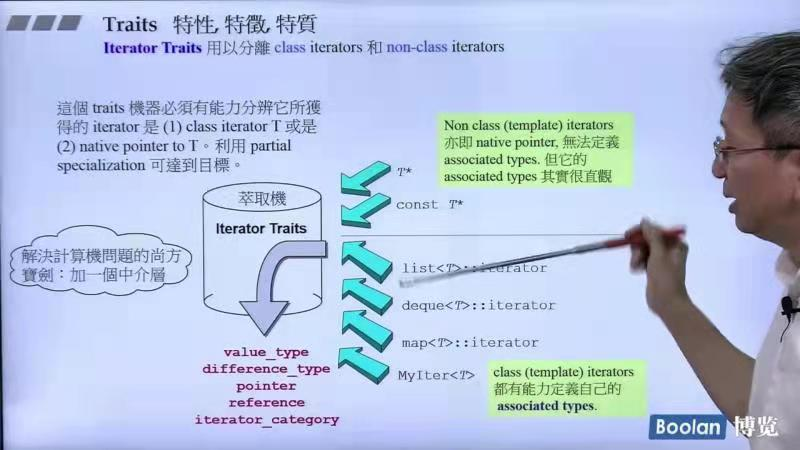
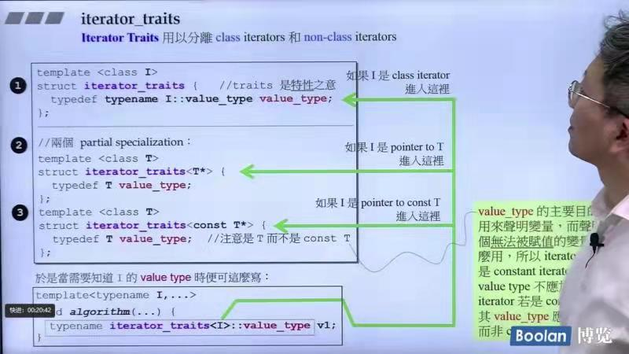
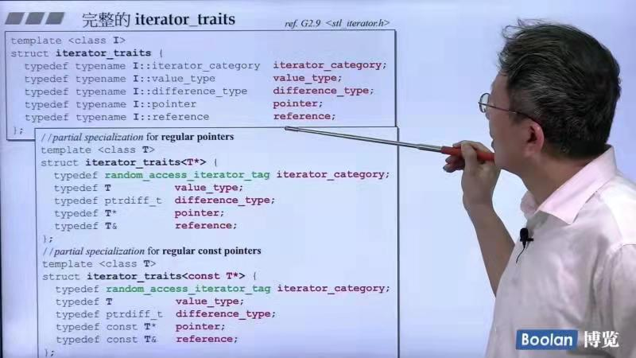

## 第六讲：迭代器设计的原则&iterator traits的作用与设计

### iterator traits
iterator traits是为了提取出迭代器的特点，迭代器必须有能力回答algorithm提出的问题。

c++标准库设计了5种回答方式,集成在class中（迭代器相关的类型，迭代器模版中本身必须定义出来）：
* iterator_category：迭代器的类型，具体表现在能否++或者--或者一下加减很多步
* difference_type：代表两个iterator的距离应该用什么type来表现（随机访问：unsign interger，实现链表的都用ptrdiff_t类型）
* value_type：iterator所指元素的类型
* reference：引用（暂未使用）
* pointer：指针（暂未使用）

但如果iterator本身不是class，例如native pointer（退化的iterator），如何回答算法的5个问题？

iterator traits用于分离class iiterators和non-class iterators

