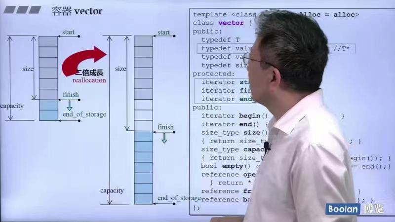
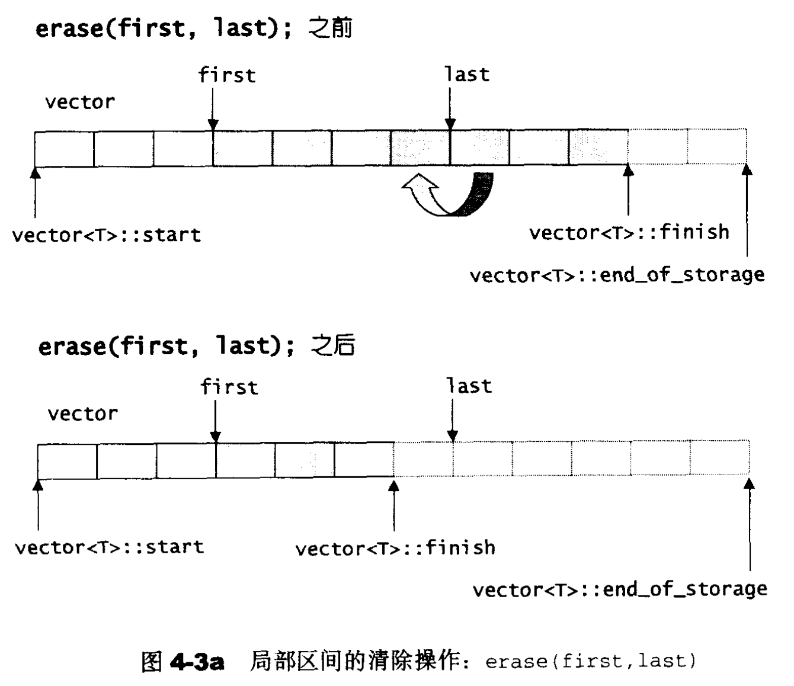
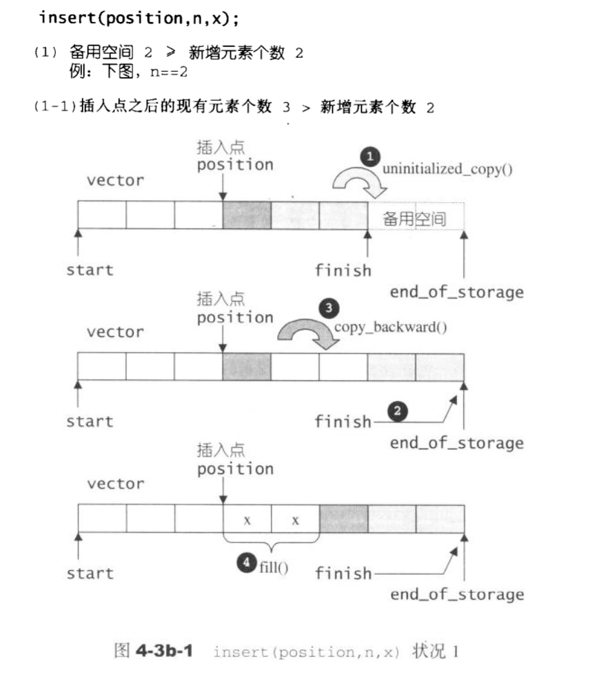
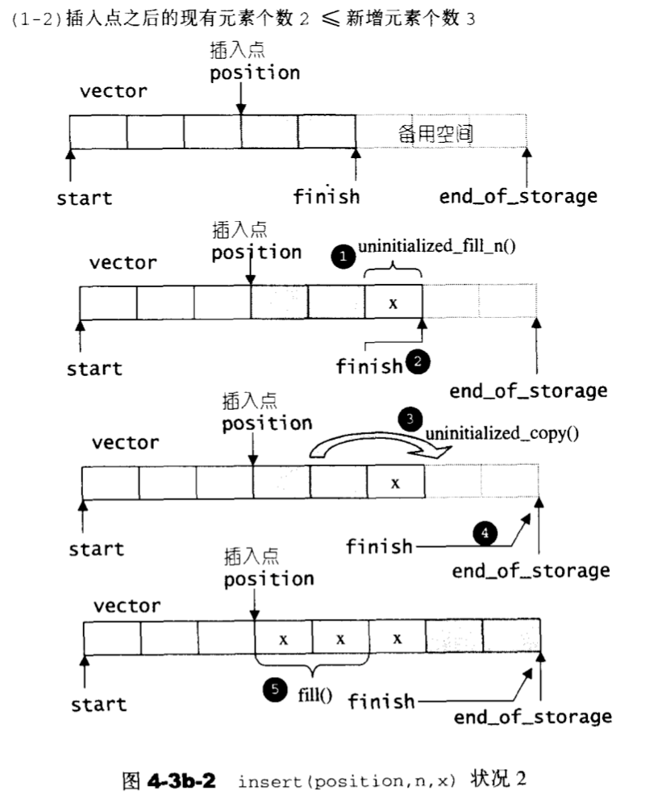
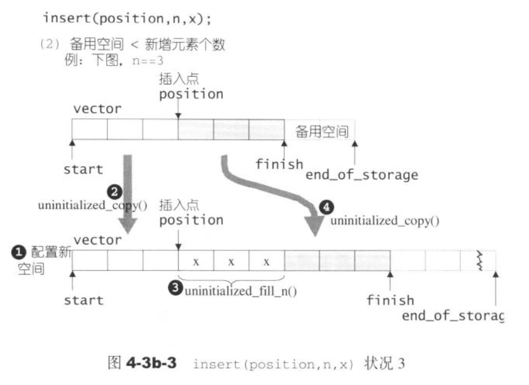

## 第七讲：vector容器深入探索

vector是动态空间，随着元素的加入，它的内部机制会自动扩充空间以容纳新元素。

### vector扩容机制(GNU 2.9版)


从途中可以看出，有三个非常关键的指针`start`，`finish`，`end_of_storage`:
* `start`指向第一个元素的内存空间，也就是begin()方法指向的内存空间。
* `finish`指向当前使用中的最后一个元素的后一个位置的内存空间，也就是end()方法指向的内存空间！
* `end_of_storage`指向当前最大可用空间的尾。

源码：
```c++
template <class T, class Alloc = alloc>  // 預設使用 alloc 為配置器
class vector {
public:
    // 以下標示 (1),(2),(3),(4),(5)，代表 iterator_traits<I> 所服務的5個型別。
    typedef T value_type;				// (1)
    typedef value_type* pointer; 			// (2)
    typedef const value_type* const_pointer;
    typedef const value_type* const_iterator;
    typedef value_type& reference; 		// (3)
    typedef const value_type& const_reference;
    typedef size_t size_type;
    typedef ptrdiff_t difference_type; 	// (4)
    // 以下，由於vector 所維護的是一個連續線性空間，所以不論其元素型別為何，
    // 原生指標都可以做為其迭代器而滿足所有需求。
    typedef value_type* iterator;
    /* 根據上述寫法，如果客端寫出這樣的碼：
      vector<Shape>::iterator is;
      is 的型別其實就是Shape*
      而STL 內部運用 iterator_traits<is>::reference 時，獲得 Shape&
                 運用iterator_traits<is>::iterator_category 時，獲得 
                      random_access_iterator_tag		(5)
      （此乃iterator_traits 針對原生指標的特化結果）
    */

    // vector採用簡單的線性連續空間。以兩個迭代器start和end分別指向頭尾，
    // 并以迭代器end_of_storage指向容量尾端。容量可能比(尾-头)还大
protected:
    iterator start;
    iterator finish;
    iterator end_of_storage;
public:
    iterator begin() { return start; }
    const_iterator begin() const { return start; }
    iterator end() { return finish; }
    /*通过函数相减有利于后期修改指针时，不需要修改size()方法*/
    size_type size() const { return size_type(end() - begin()); }
    /*capacity代表最大容量*/
    size_type capacity() const { return size_type(end_of_storage - begin()); }
    bool empty() const { return begin() == end(); }
    /*连续空间的容器都会有[]的运算符重载*/
    reference operator[](size_type n) { return *(begin() + n); }
    // 取出第一個元素內容
    reference front() { return *begin(); }
    // 取出最後一個元素內容
    reference back() { return *(end() - 1); }
}
```

通过`push_back()`方法来看扩容机制：
```c++
// 增加一個元素，做為最後元素
    void push_back(const T& x) {
        if (finish != end_of_storage) {  // 還有備用空間
            construct(finish, x);   		// 直接在備用空間中建構元素。
            ++finish;                          	// 調整水位高度
        }
        else                                  // 已無備用空間
            insert_aux(end(), x);			
    }
```
其中`insert_aux()`的具体实现如下：
```c++
template <class T, class Alloc>
void vector<T, Alloc>::insert_aux(iterator position, const T& x) {
    /*这里再检查一次是因为还有其他函数会调用这个函数*/
    if (finish != end_of_storage) {  // 還有備用空間
        // 在備用空間起始處建構一個元素，並以vector 最後一個元素值為其初值。    
        construct(finish, *(finish - 1));
        // 調整水位。
        ++finish;
        // 以下做啥用？
        T x_copy = x;
        copy_backward(position, finish - 2, finish - 1);
        *position = x_copy;
    }
    else {		// 已无备用空间
        const size_type old_size = size();
        const size_type len = old_size != 0 ? 2 * old_size : 1;
        // 以上配置原則：如果原大小為0，則配置 1（個元素大小）；
        // 如果原大小不為0，則配置原大小的兩倍，
        // 前半段用來放置原資料，後半段準備用來放置新資料。
        iterator new_start = data_allocator::allocate(len); // 实际配置
        iterator new_finish = new_start;
        __STL_TRY {
            // 將原vector 的內容拷貝到新 vector。
            new_finish = uninitialized_copy(start, position, new_start);
            // 為新元素設定初值x
            construct(new_finish, x);
            // 調整水位。
            ++new_finish;
            // 拷贝安插点后的原内容（因为它可能被insert(p, x)呼叫）
            new_finish = uninitialized_copy(position, finish, new_finish);
        }
    }
    #ifdef  __STL_USE_EXCEPTIONS 
    catch(...) {
      // "commit or rollback" 語意：若非全部成功，就一個不留。
      destroy(new_start, new_finish); 
      data_allocator::deallocate(new_start, len);
      throw;
    }
    #endif /* __STL_USE_EXCEPTIONS */

    // 解構并释放原 vector
    destroy(begin(), end());
    deallocate();

    // 調整迭代器，指向新vector
    start = new_start;
    finish = new_finish;
    end_of_storage = new_start + len;
  }
}
```

总结一下vector的扩容机制，用一个当前最大可用空间为8的vector中插入第8个元素的变化过程来说明：
* 1.判断是否还有可用空间（通过`finish`和`end_of_storage`指针来判断）
* 2.调用insert_aux()函数来扩容，配置原则如下：
    * 如果原大小为0，則配置 1（個元素大小）；
    * 如果原大小不为0，則配置原大小的兩倍，
* 3.将原vector 的内容拷贝到新 vector，并为新元素设定初值x，并调整指针的位置。
* 4.拷贝安插点后的原内容（因为它可能被insert(p, x)呼叫）
* 5.删除原来的vector的内容

**注意：使用vector时如果大量扩容会导致大量调用拷贝构造和析构函数造成很大的开销。**

*vector在GNU 4.9里面使用了很多class继承，较为复杂*

### vector的迭代器
使用：
```c++
vecotr<int> vec;
vector<int>::iterator it;
it = vec.begin();
```

### vector的元素操作
这里主要讲pop_back, erase, clear, insert

* 先来看pop_back()：
```c++
void pop_back() {
    --finish;    //将尾端标记往前移一格
    destroy(finish);//使用全局函数destroy将元素删除(调用析构函数)
}
```
* erase清除[first, last)中的所有元素
```c++
iterator erase(iterator first, iterator last) {
    iterator i = copy(last, finish, first);//将last到finish之间的元素放到first的位置
    destroy(i, finish);//删除copy对象的起始位置last和finish之间的元素
    finish = finish - (last - first);//更新finish的位置
    return first;//返回起始位置
} 
```

用一张图来解释上述过程：

**可以看到整体的过程是复制删除区间之后的剩下的元素到要删除元素区间的起始位置，
使用的是内存覆盖的原理**

* erase清除某个位置上的元素
```c++
iterator erase(iterator position) {
    if(position + 1 != end())
        copy(positon + 1, finish, positon);//将后面的元素往前移
    --finish;
    destroy(finish);
    return position;
} 
```
* vector的insert实现(返回插入位置的迭代器)
由于源码长度过长，直接用图片解释插入的过程： 
  * 状况1：
  
    
  
  * 状况2：
  
    
  * 状况3：

    

总结一下insert(position, n, x)插入n个值为x的元素的两种状况： 
* 备用空间y >= n的情况：
  * 插入位置之后的元素个数a >= n：
    * 1.先将old_finish之前的n个元素往后移动到从old_finish开始，并更新finish的位置，变为new_finish
    * 2.再将插入点之后剩余的元素往后移动n个位置
    * 3.再往插入位置插入n个元素x
  * 插入位置之后的元素个数a <= n：
    * 1.先在末尾位置插入（n - a）个元素x，并更新finish的位置
    * 2.再将插入位置之后到old_finish位置的元素copy到new_finish之后
    * 3.最后在插入位置插入a个元素x
    
    *这样做可以减少元素移动的个数*
* 备用空间y <= n的情况：
  * 首先进行vector的扩容过程（上面已经仔细说过）
  * 扩容之后又会进入备用空间y >= n的情况，按照上述规则来移动，目的是为了尽可能减少元素的移动。
