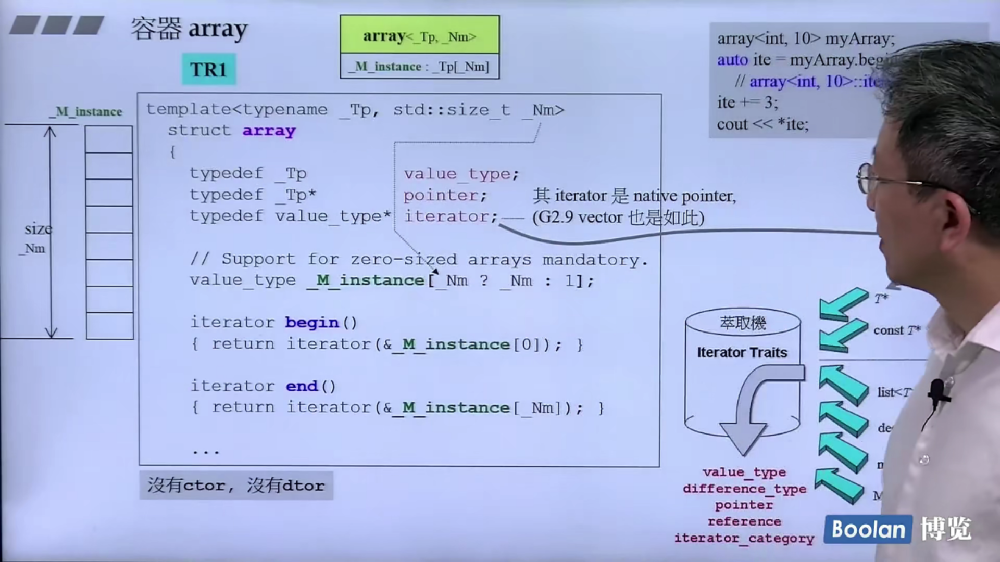

## 第八讲：array和forward_list深度探索

### 容器array

*array在c中本身就存在，为什么array要成为一个容器？*

array成为容器的好处：array可以使用迭代器，可以使用标准算法，更加地快捷。

使用标准array的方法：
```c++
array<int, 10> myArray;
auto it = myArray.begin();
//array<int, 10>::iterator it = myArray.begin();
it += 3;
cout << *it;
```
源码如下图，较简单(TR1版本)：



### forward_list
单向链表的结构与list双向链表的结构类似，可以类推。（c++11以前为slist）