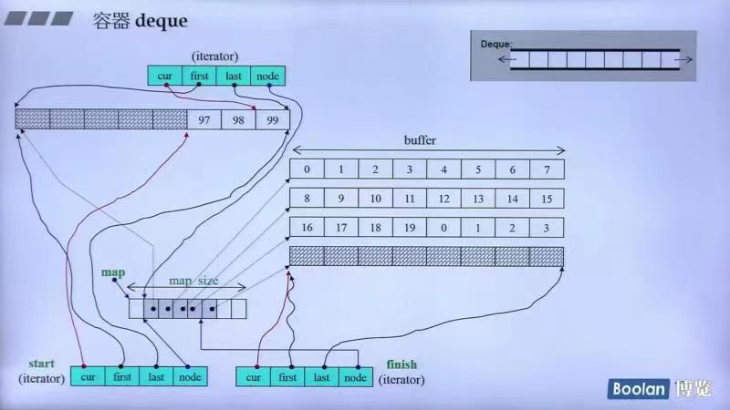

## 第九讲：deque，queue，stack深度探索

### 容器deque

#### deque的结构和设计
deque的底层结构：



如上图所示：
* deque的迭代器是一个class，内部有四个元素cur，first，last，node
    * node指向某一个buffer，first和last分别指向这一个buffer的头部和尾部，cur指向当前元素
    * cur一旦走到了一个buffer的边界，则直接走到下一个buffer的开头（维持左闭右开）
* deque向前扩充和向后扩充都是使用buffer来进行的（之前已经讲过了）
* start和finish是为了维护改容器的begin()和end()

源码如下(GNU2.9)：
```c++
template<class T, class Alloc=alloc, size_t BufSiz=0>
class deque {
public:
    typedef T value_type;
    typedef __deque_iterator<T, T&, T*, BufSiz> iterator;
protected:
    typedef pointer* map_pointer;//T** 指向指针的指针
protected:    
    iterator start;//对应begin()的iterator类
    iterator finish;//对应end()的iterator类
    map_pointer map;//单个buffer
    size_type map_size;//控制中心的大小（也就是有多少个buffer）
public:    
    iterator begin() { return start; }
    iterator edn() { return finish; }
    size_type size() const { return finish - start; }
};
```
谈一谈参数的设置：如果BufSiz传入5，则为5；如果没有指定，则默认为0；如果元素大小sz大于512Bytes
，它就让一个缓冲区只放一个元素；如果小于512Bytes,则传回512/sz。（不过新版本不允许指定大小）

其中`__deque_iterator`如下所示：
```c++
template <class T, class Ref, class Ptr>
struct __deque_iterator { 	// 未繼承 std::iterator
  // 未繼承 std::iterator，所以必須自行撰寫五個必要的迭代器相應型別
  typedef random_access_iterator_tag iterator_category; // (1)
  typedef T value_type; 				// (2)
  typedef Ptr pointer; 				// (3)
  typedef Ref reference; 				// (4)
  typedef size_t size_type;
  typedef ptrdiff_t difference_type; 	// (5)
  typedef T** map_pointer;
  typedef __deque_iterator self;

  // 保持與容器的聯結
  T* cur;	// 此迭代器所指之缓冲区中的现行（current）元素
  T* first;	// 此迭代器所指之缓冲区的头
  T* last;	// 此迭代器所指之缓冲区的尾（含借用空间）
  map_pointer node;
  ...
};
```

deque和vector的差异：
* deque允许常数时间内对头端进行元素的插入和删除操作
* deque没有所谓的容量的观念，因为它是动态地以分段连续空间组合而成

#### deque<T>::insert()
源码：
```c++
insert(iterator pos, size_type n, const value_type& x) {
    if (pos.cur == start.cur) {//如果安插点是deque的最前端
        push_front(x);//交给push_front来做
        return start;
    }
    else if (pos.cur == finish.cur) {//如果安插点是deque的最尾端
        push_back(x);//交给push_back()来做
        iterator tmp = finish;
        --tmp;
        return tmp;
    }
    else insert_aux(pos, n, x);
}
```
其中`insert_aux`如下：
```c++
typename deque<T, Alloc, BufSize>::iterator
deque<T, Alloc, BufSize>::insert_aux(iterator pos, const value_type& x) {
  difference_type index = pos - start;	// 安插點之前的元素個數
  value_type x_copy = x;
  if (index < size() / 2) {			// 如果安插點之前的元素個數比較少
    push_front(front());			// 在最前端加入與第一元素同值的元素。
    iterator front1 = start;		// 以下標示記號，然後進行元素搬移...
    ++front1;
    iterator front2 = front1;
    ++front2;
    pos = start + index;
    iterator pos1 = pos;
    ++pos1;
    copy(front2, pos1, front1);		// 元素搬移
  }
  else {						// 安插點之後的元素個數比較少
    push_back(back());			// 在最尾端加入與最後元素同值的元素。
    iterator back1 = finish;	// 以下標示記號，然後進行元素搬移...
    --back1;
    iterator back2 = back1;
    --back2;
    pos = start + index;
    copy_backward(pos, back2, back1);	// 元素搬移
  }
  *pos = x_copy;	// 在安插點上設定新值
  return pos;
}
```
**可以看出deque的insert是根据插入位置离头或者尾哪个更近，就往哪边推，也就是将安插点之前或之后的元素集体挪一格。**