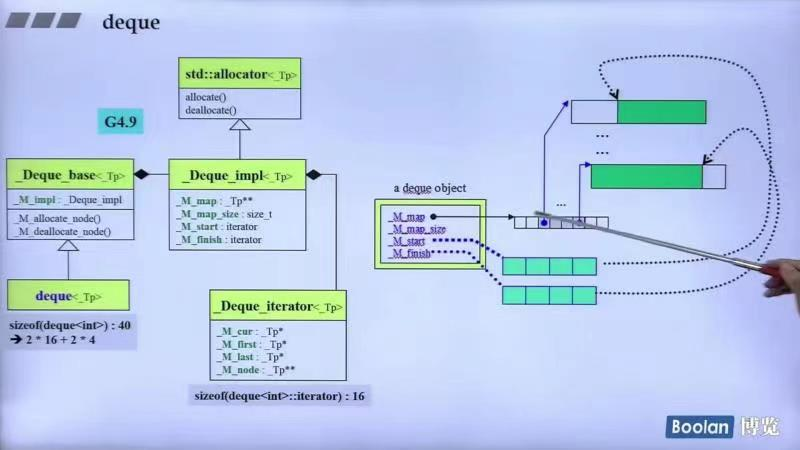

## 第九讲：deque，queue，stack深度探索

### 容器deque

#### deque的结构和设计
deque的底层结构：


如上图所示：
* deque的迭代器是一个class，内部有四个元素cur，first，last，node
    * node指向某一个buffer，first和last分别指向这一个buffer的头部和尾部，cur指向当前元素
    * cur一旦走到了一个buffer的边界，则直接走到下一个buffer的开头（维持左闭右开）
* deque向前扩充和向后扩充都是使用buffer来进行的（之前已经讲过了）
* start和finish是为了维护改容器的begin()和end()

源码如下(GNU2.9)：
```c++
template<class T, class Alloc=alloc, size_t BufSiz=0>
class deque {
public:
    typedef T value_type;
    typedef __deque_iterator<T, T&, T*, BufSiz> iterator;
protected:
    typedef pointer* map_pointer;//T** 指向指针的指针
protected:    
    iterator start;//对应begin()的iterator类
    iterator finish;//对应end()的iterator类
    map_pointer map;//单个buffer
    size_type map_size;//控制中心的大小（也就是有多少个buffer）
public:    
    iterator begin() { return start; }
    iterator edn() { return finish; }
    size_type size() const { return finish - start; }
};
```
谈一谈参数的设置：如果BufSiz传入5，则为5；如果没有指定，则默认为0；如果元素大小sz大于512Bytes
，它就让一个缓冲区只放一个元素；如果小于512Bytes,则传回512/sz。（不过新版本不允许指定大小）

其中`__deque_iterator`如下所示：
```c++
template <class T, class Ref, class Ptr>
struct __deque_iterator { 	// 未繼承 std::iterator
  // 未繼承 std::iterator，所以必須自行撰寫五個必要的迭代器相應型別
  typedef random_access_iterator_tag iterator_category; // (1)
  typedef T value_type; 				// (2)
  typedef Ptr pointer; 				// (3)
  typedef Ref reference; 				// (4)
  typedef size_t size_type;
  typedef ptrdiff_t difference_type; 	// (5)
  typedef T** map_pointer;
  typedef __deque_iterator self;

  // 保持與容器的聯結
  T* cur;	// 此迭代器所指之缓冲区中的现行（current）元素
  T* first;	// 此迭代器所指之缓冲区的头
  T* last;	// 此迭代器所指之缓冲区的尾（含借用空间）
  map_pointer node;
  ...
};
```

deque和vector的差异：
* deque允许常数时间内对头端进行元素的插入和删除操作
* deque没有所谓的容量的观念，因为它是动态地以分段连续空间组合而成

#### deque<T>::insert()
源码：
```c++
insert(iterator pos, size_type n, const value_type& x) {
    if (pos.cur == start.cur) {//如果安插点是deque的最前端
        push_front(x);//交给push_front来做
        return start;
    }
    else if (pos.cur == finish.cur) {//如果安插点是deque的最尾端
        push_back(x);//交给push_back()来做
        iterator tmp = finish;
        --tmp;
        return tmp;
    }
    else insert_aux(pos, n, x);
}
```
其中`insert_aux`如下：
```c++
typename deque<T, Alloc, BufSize>::iterator
deque<T, Alloc, BufSize>::insert_aux(iterator pos, const value_type& x) {
  difference_type index = pos - start;	// 安插點之前的元素個數
  value_type x_copy = x;
  if (index < size() / 2) {			// 如果安插點之前的元素個數比較少
    push_front(front());			// 在最前端加入與第一元素同值的元素。
    iterator front1 = start;		// 以下標示記號，然後進行元素搬移...
    ++front1;
    iterator front2 = front1;
    ++front2;
    pos = start + index;
    iterator pos1 = pos;
    ++pos1;
    copy(front2, pos1, front1);		// 元素搬移
  }
  else {						// 安插點之後的元素個數比較少
    push_back(back());			// 在最尾端加入與最後元素同值的元素。
    iterator back1 = finish;	// 以下標示記號，然後進行元素搬移...
    --back1;
    iterator back2 = back1;
    --back2;
    pos = start + index;
    copy_backward(pos, back2, back1);	// 元素搬移
  }
  *pos = x_copy;	// 在安插點上設定新值
  return pos;
}
```
**可以看出deque的insert是根据插入位置离头或者尾哪个更近，就往哪边推，也就是将安插点之前或之后的元素集体挪一格。**

#### deque如何模拟连续空间

```c++
reference operator[] (size_type n)
{
    return start[different_type(n)];
}

reference front() { return *start; }

reference back() 
{
    iterator tmp = finish;
    --tmp;
    return *tmp;
}

size_type size() const { return finish - start; }//这里的减号进行了操作符重载

bool empty() const { return finish == start; }
```

**全部归功于deque iterators的操作符重载**：
```c++
//指针的操作符重载
reference operator*() const { return *cur; }
pointer operator->() const { return &(operator*()); }
//"-"号的操作符重载
difference_type operator-(const self& x) const {
    //buffer_size()代表单个缓冲的容量
    //node - x.node - 1 代表首尾buffers之间的完整的buffers数量
    //cur - first 代表末尾（当前）buffer的元素量
    //x.last - x.cur 代表起始buffer的元素量
    //node代表中控器的某个格子，x代表最前面的buffer
    return difference_type(buffer_size()) * (node - x.node - 1) 
    + (cur - first) + (x.last - x.cur);
}
```
自增和自减的操作符重载：
```c++
//前++
self& operator++() {
    ++cur;			// 切換至下一個元素。
    if (cur == last) {		// 如果已达所在缓冲区的尾端
         set_node(node + 1);	// 就切换至下一个缓冲区
         cur = first;           //的第一个元素。
    }
    return *this; 
}
//后++
self operator++(int)  {
    self tmp = *this;
    ++*this;
    return tmp;
}
//前--
self& operator--() {
    if (cur == first) {	// 如果已达所在缓冲区的头端
        set_node(node - 1);	// 就切换至前一个缓冲区
        cur = last;	        // 的最后一个元素。
    }
    --cur;			// 切換至前一個元素。
    return *this;
}
//后--
self operator--(int) {
    self tmp = *this;
    --*this;
    return tmp;
}
```

其中的`set_node`函数如下：
```c++
void set_node (map_pointer new_node)
{
    node = new_node;
    //重设first和last
    first = *new_node;
    last = fisrt + difference_type(buffer_size());
}
```
"+="，"+"和"-="，"-"和下标操作符重载：
```c++
self& operator+=(difference_type n) {
    difference_type offset = n + (cur - first);//+=n之后距离开头的偏移量
    if (offset >= 0 && offset < difference_type(buffer_size()))
        // 目标位置在同一缓冲区内
        cur += n;
    else {
        // 目标位置不在同一缓冲区内，计算缓冲区需要前进的格数（退回中控器）
        difference_type node_offset =
        offset > 0 ? offset / difference_type(buffer_size())
                   : -difference_type((-offset - 1) / buffer_size()) - 1;
        // 切換至正確的缓冲区
        set_node(node + node_offset);
        // 切換至正確的元素
        cur = first + (offset - node_offset * difference_type(buffer_size()));
    }
    return *this;
}

self operator+(difference_type n) const {
    self tmp = *this;
    return tmp += n; // 喚起operator+=
}

self& operator-=(difference_type n) { return *this += -n; }
// 以上利用operator+= 來完成 operator-=

self operator-(difference_type n) const {
    self tmp = *this;
    return tmp -= n; // 喚起operator-=
}
//连续的容器一定会有[]重载
reference operator[](difference_type n) const { return *(*this + n); }
```
deque在GNU4.9下的结构：



### queue容器和stack容器

queue和stack的功能特性与deque的相通之处：


* queue部分源码：
```c++
template <class T, class Sequence = deque<T>>
class queue {
    friend bool operator== __STL_NULL_TMPL_ARGS (const queue& x, const queue& y);
    friend bool operator< __STL_NULL_TMPL_ARGS (const queue& x, const queue& y);
public:
    typedef typename Sequence::value_type value_type;
    typedef typename Sequence::size_type size_type;
    typedef typename Sequence::reference reference;
    typedef typename Sequence::const_reference const_reference;
protected:
    Sequence c;	// 底層容器
public:
    // 以下完全利用 Sequence c 的操作，完成 queue 的操作。
    bool empty() const { return c.empty(); }
    size_type size() const { return c.size(); }
    reference front() { return c.front(); }
    const_reference front() const { return c.front(); }
    reference back() { return c.back(); }
    const_reference back() const { return c.back(); }
    // deque 是兩頭可進出，queue 是末端進，前端出（所以先進者先出）。
    void push(const value_type& x) { c.push_back(x); }
    void pop() { c.pop_front(); }
};
```
**可以看出queue基本都是在deque的基础上实现的**

* stack部分源码：
```c++
template <class T, class Sequence = deque<T>>
class stack {   
    friend bool operator== __STL_NULL_TMPL_ARGS (const stack&, const stack&);
    friend bool operator< __STL_NULL_TMPL_ARGS (const stack&, const stack&);
public:
    typedef typename Sequence::value_type value_type;
    typedef typename Sequence::size_type size_type;
    typedef typename Sequence::reference reference;
    typedef typename Sequence::const_reference const_reference;
protected:
    Sequence c;	// 底層容器
public:
    // 以下完全利用 Sequence c 的操作，完成 stack 的操作。
    bool empty() const { return c.empty(); }
    size_type size() const { return c.size(); }
    reference top() { return c.back(); }
    const_reference top() const { return c.back(); }
    // deque 是兩頭可進出，stack 是末端進，末端出（所以後進者先出）。
    void push(const value_type& x) { c.push_back(x); }
    void pop() { c.pop_back(); }
};
```
**可以看出stack也都是在deque的基础上实现的**

#### queue和stack，关于其iterator和底部结构
* **stack和queue都不允许遍历，也不提供iterator，因为这会破坏这两个结构的特性！**
* stack和queue都可以选择list或者deque作为底部结构，也就是说list可以取代deque成为queue和stack的底部结构！
* stack可选择vector作为底部结构，queue不可选择vector作为底部结构（因为不能调用其pop()函数），
**但如果用不到pop()函数也是ok的，编译器不会报错**
* stack和queue都不可用set或者map作为底部支撑

